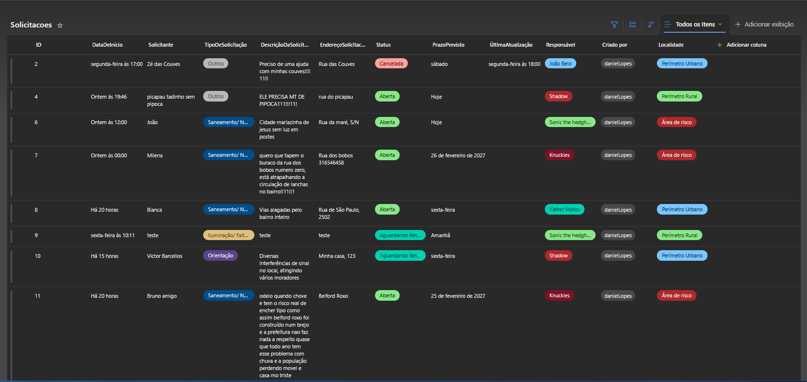
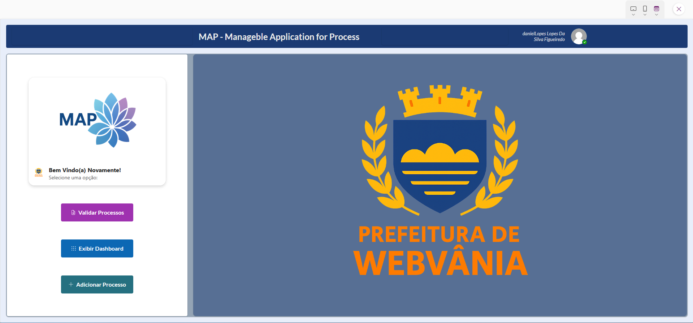
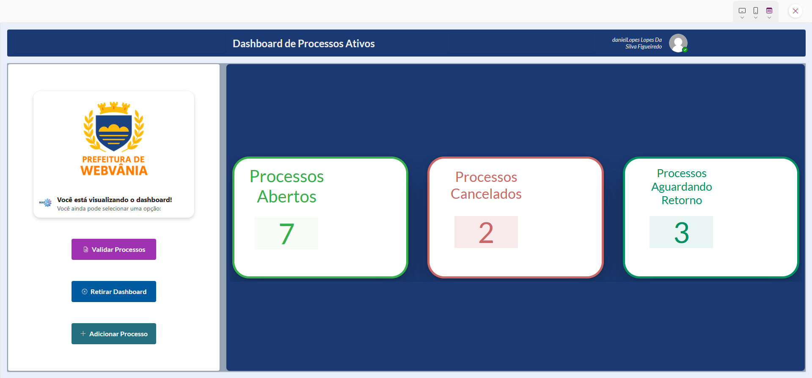
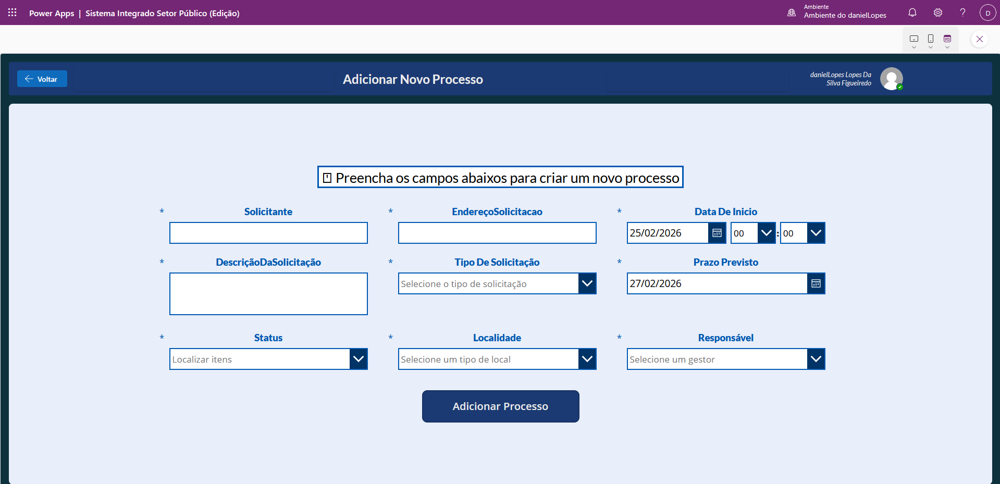
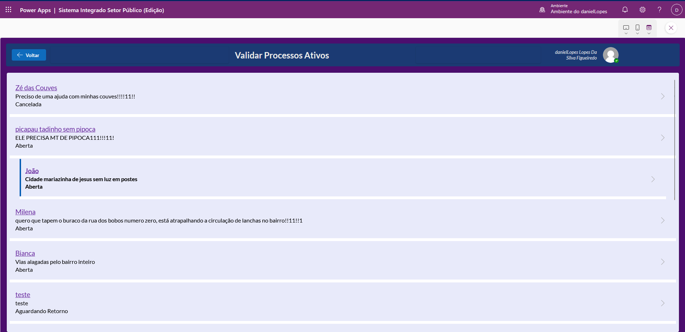
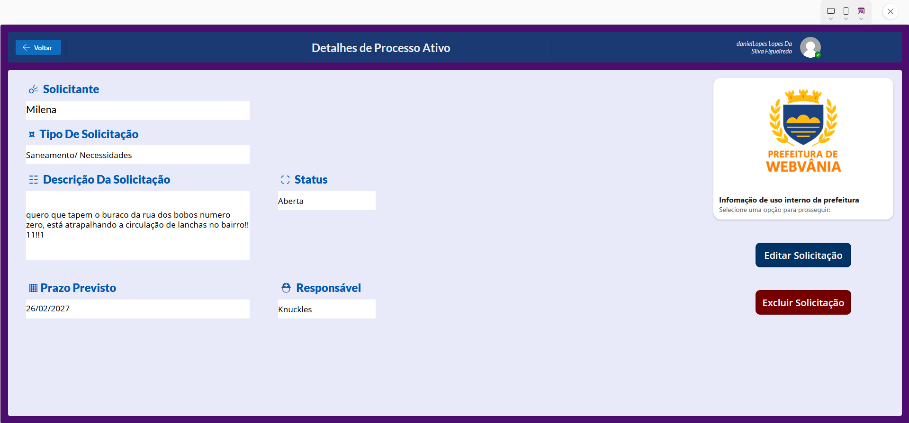
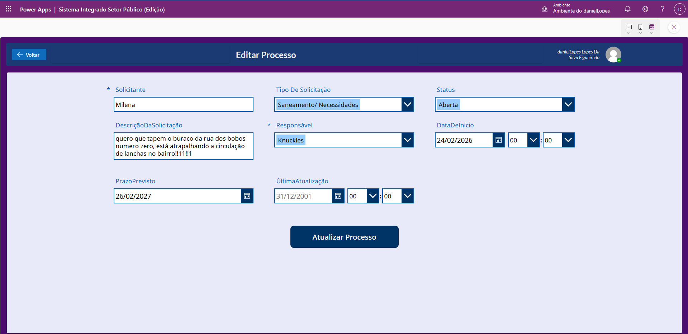
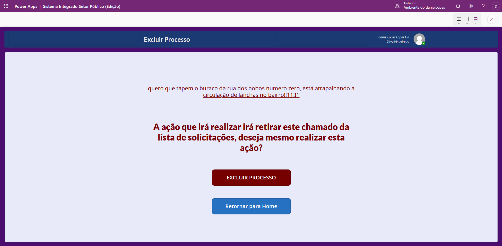

# 🏛️ MAP — Manageable Application for Process (Setor Público)

> Um aplicativo Power Apps para **registrar, acompanhar, validar e encerrar solicitações públicas**, integrado ao **SharePoint** como back‑end de dados.


---

## 📋 Índice

- [Visão Geral](#-visão-geral)
- [Recursos Principais](#-recursos-principais)
- [Arquitetura de Dados (SharePoint)](#%EF%B8%8F-arquitetura-de-dados-sharepoint)
- [Telas do App](#%EF%B8%8F-telas-do-app)
  - [Home](#-home)
  - [Dashboard de Processos Ativos](#-dashboard-de-processos-ativos)
  - [Adicionar Novo Processo](#-adicionar-novo-processo)
  - [Validar Processos Ativos](#-validar-processos-ativos)
  - [Detalhes do Processo](#-detalhes-do-processo)
  - [Editar Processo](#%EF%B8%8F-editar-processo)
  - [Excluir Processo (Confirmação)](#%EF%B8%8F-excluir-processo-confirmação)
- [Fórmulas-Chave](#-fórmulas-chave)
- [Instalação & Publicação](#-instalação--publicação)
- [Permissões](#-permissões)
- [Roadmap](#-roadmap)
- [Contato](#-contato)

---

## 🎯 Visão Geral

O **MAP** organiza o ciclo de vida das solicitações públicas (ex.: obras, serviços urbanos, saneamento), permitindo:

- Cadastro de solicitações com **prazo previsto**, **tipo**, **localidade** e **responsável**  
- **Validação**/triagem e **edição** dos dados  
- **Visualização** consolidada via **dashboard** (processos por status)  
- **Exclusão** (ou arquivamento) controlada

O back‑end é uma lista do **SharePoint** (`Solicitacoes`), o que facilita governança, segurança e integração com **Power Automate**.

---

## ✨ Recursos Principais

- **CRUD completo** de processos (Create, Read, Update, Delete)
- **Campos Choice** e **Pessoa** com mapeamento correto para SharePoint
- **Dashboard interno** com KPIs e gráficos por **Status**
- **Filtro por prazos** e estados operacionais
- **Confirmação de exclusão** com feedback visual
- **Design consistente** (header, cards, containers e sombras)

---

## 🗂️ Arquitetura de Dados (SharePoint)

Lista principal: **`Solicitacoes`**

Campos usuais (mapeamento do app):
- `Title` (Texto) — título/assunto
- `DescricaoDaSolicitacao` (Texto longo)
- `EnderecoSolicitacao` (Texto)
- `TipoDeSolicitacao` (**Choice** único)
- `Status` (**Choice** único — ex.: *Aberta*, *Cancelada*, *Aguardando Retorno*)
- `Localidade` (**Choice** único — ex.: *Perímetro Urbano*, *Área de risco*)
- `Responsavel` (**Pessoa** único)
- `DataDeInicio` (Data/Hora)
- `PrazoPrevisto` (Data)
- `UltimaAtualizacao` (Data/Hora)
- (opcional) `IdOrigem` (Número) — quando mover/arquivar para outra lista

> **Observação:** os rótulos de **Status** devem ser usados exatamente como estão no SharePoint (ex.: “**Aberta**”, e não “Aberto”).

**Exibição no SharePoint:**



---

## 🖥️ Telas do App

### 🏠 Home



**Objetivo:** ponto de entrada para as operações do sistema.  
**Componentes:**
- **Logo** e identidade visual
- **Botões de ação rápida:**
  - **Validar Processos** → navega para a tela de validação/galeria
  - **Exibir Dashboard** → abre a tela com KPIs e gráficos
  - **Adicionar Processo** → abre o formulário de novo processo
- **Layout responsivo**: painel lateral (ações) + área central (banner/logo)

---

### 📈 Dashboard de Processos Ativos



**Objetivo:** visão de saúde operacional dos processos.

**KPIs** (exemplos):
- **Processos Abertos**  
- **Processos Cancelados**  
- **Processos Aguardando Retorno**

**Gráficos** (opcional): pizza/coluna agrupando por `Status`.

---

### ➕ Adicionar Novo Processo



**Objetivo:** cadastrar uma nova solicitação.

**Destaques funcionais:**
- `PrazoPrevisto` default: **Hoje + 2 dias**
  ```powerapps
  // No DatePicker: DefaultDate
  Today() + 2
  ```
- **Choice (único)**: `TipoDeSolicitacao`, `Status`, `Localidade`
- **Pessoa (único)**: `Responsavel` com `Choices([@Solicitacoes].Responsavel)`

---

### 🧾 Validar Processos Ativos



**Objetivo:** triagem e navegação para detalhes/edição/exclusão.

**Componentes:**
- **Galeria** listando título/descrição/status
- **Seleção** abre detalhes do item

---

### 🔎 Detalhes do Processo



**Objetivo:** visualizar campos do registro selecionado.

**Ações:**
- **Editar Solicitação**
- **Excluir Solicitação** (navega para tela de confirmação)

---

### ✏️ Editar Processo



**Objetivo:** atualizar campos do processo.

**Boas práticas adotadas:**
- `DefaultSelectedItems` para Choice/Pessoa usando `Parent.Default`
- `Update` do DataCard:
  - **Choice único** → `Combo.Selected.Value`
  - **Pessoa** → `Combo.Selected`

---

### 🗑️ Excluir Processo (Confirmação)



**Objetivo:** confirmação explícita antes da remoção do item.

**Ação principal:**
```powerapps
If(
    IsBlank(varRegistroParaExcluir) || IsBlank(varRegistroParaExcluir.ID);
    Notify("Nenhum registro selecionado."; NotificationType.Error);
    IfError(
        Remove([@Solicitacoes]; varRegistroParaExcluir);
        Notify("Erro ao excluir."; NotificationType.Error);
        Notify("Registro excluído com sucesso."; NotificationType.Success);
        Refresh([@Solicitacoes]);
        Navigate(Home; ScreenTransition.Fade)
    )
)
```

> Alternativa segura: passar **apenas o ID** e fazer `LookUp()` antes do `Remove()`.

---

## 🧠 Fórmulas-Chave

### 1) **KPIs por Status** (Choice único)
```powerapps
// Abertas
CountRows( Filter(Solicitacoes; Status.Value = "Aberta") )

// Canceladas
CountRows( Filter(Solicitacoes; Status.Value = "Cancelada") )

// Aguardando Retorno
CountRows( Filter(Solicitacoes; Status.Value = "Aguardando Retorno") )
```

### 2) **Gráfico por Status** (simples e sem colunas aninhadas)
```powerapps
// Items do gráfico (Pie/Column)
With(
    {
        base: AddColumns(Solicitacoes; "StatusTxt"; Coalesce(Status.Value; "Sem status"))
    };
    ShowColumns(
        AddColumns(
            GroupBy(base; "StatusTxt"; "Grp");
            "Qtd"; CountRows(Grp)
        );
        "StatusTxt"; "Qtd"
    )
)
```

### 3) **Choices — configuração correta**
```powerapps
// ComboBox.Items (Choice único)
Choices([@Solicitacoes].Status)

// ComboBox.DefaultSelectedItems
If(IsBlank(Parent.Default); Blank(); [Parent.Default])

// DataCard.Update (Choice único)
ComboStatus.Selected.Value

// Pessoa (único)
Choices([@Solicitacoes].Responsavel)
```

### 4) **Variável para navegação/seleção**
```powerapps
// Na galeria → abrir detalhes
Set(varRegistroParaExcluir; ThisItem);
Navigate(ScreenDetalhesProcessosAtivos; ScreenTransition.Fade)
```

---

## 🚀 Instalação & Publicação

1. **Conexões**  
   - Adicione a conexão com **SharePoint**  
   - Conecte a lista **`Solicitacoes`** (crie conforme a arquitetura acima)

2. **Importação (se aplicável)**  
   - Importe a solução/app no ambiente desejado  
   - Repare as conexões na primeira abertura

3. **Publicar e compartilhar**  
   - *File → Save → Publish*  
   - *Share* com os usuários/grupos (perfis de acesso abaixo)

---

## 🔐 Permissões

- **SharePoint (Lista `Solicitacoes`)**
  - **Leitura**: usuários finais que só consultam
  - **Edição/Contribuição**: operadores/triagem
  - **Controle total**: administradores do app

- **Power Apps**
  - Compartilhar o app com os **mesmos grupos** que possuem acesso à lista

> A exclusão/movimentação exigirá, no mínimo, **Contribuição** na lista.

---

## 🧭 Roadmap

- [ ] Modo **Arquivar** (mover para lista de histórico via `Patch` + `Remove`)
- [ ] **Gráficos adicionais** (por tipo, por localidade, por responsável)
- [ ] **Validação de prazos** (atrasados, vencendo em X dias)
- [ ] Fluxo **Power Automate** para copiar **anexos** ao arquivar
- [ ] **Perfis**/papéis com comandos condicionais por nível de acesso

---

## 📞 Contato

- **Autor:** Daniel Lopes da Silva Figueiredo  
- **Links:** _(adicione aqui LinkedIn, GitHub e Email)_

---
